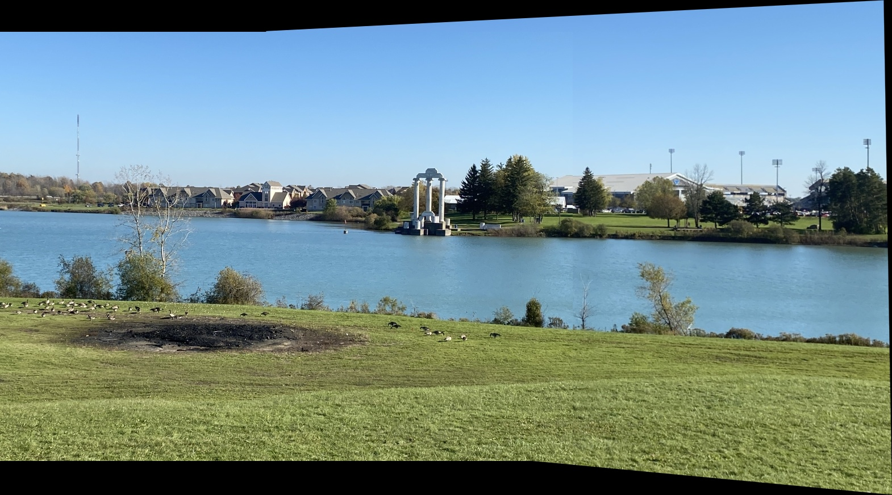

# Image-stitching-Computer-Vision

### Following are the things done:
* Firstly I have used cv2_xfeatures2d_SIFT create() to create sift object for feature extraction.
* Next, I have used siftdetectAndCompute(left img, None), sift.detectAndCompute(right img, None) to get key points and descriptors of left and right images features. Each keypoint is a special structure that has many attributes like its (x,y) coordinates, size of the meaningful neighborhood, the angle which specifies its orientation, a response that specifies the strength of key points. The descriptor is the vector of 128 bin values of each keypoint having 16x16 neighborhood information. 
* Further, I have implemented the K-Nearest Neighbour algorithm for feature matching of left and right images. In KNN algorithm I have computed the Euclidean distance(L2 norm) of each descriptor in left image with each descriptor in the right image and taken the value of k=2 i.e taken the top 2 best matches (sort the distance list and take the first two descriptors) in the right image. 
* Once I have the top 2 descriptors, I have further done the ratio test to take only those features that have a distance ratio less than the threshold value of 0.6. Next, I have fetched the respective coordinates from key points and saved the coordinates in a tuple of both the images.
*  Once I have completed the feature matching, the number of feature points is around 680 now. Next, I have implemented the RANSAC algorithm for 1000 iterations and taking 4 points at random to solve the Homography matrix. In each iteration of the ransac algorithm, I have taken 4 points at random and solved the homography matrix using svd and normalized it with last element of the matrix as it has 8 degrees of freedom. 
*  After computing the homography matrix, I have calculated the number of inliners by computing the euclidean distance with other points and saving the inlines if the distance is less than the threshold value of 6. 
*  Further I check if the computed inliners are maximum count of inliners so far or not, and save the maximum inliners. Once the Homography matrix and inliners are computed, Next I have warped and stitched the images using this information. In the warp and stitching process, first I have computed the max and min points using the cv2p_ erspectiveTransform(points list2, h). 
*  Once I have the information of max and min coordinates, next I have further computed the transformed H matrix as [[1, 0, -xmin], [0, 1, -ymin], [0, 0, 1]]. Using this transformed H, I have warped the right image that creates the panoramic window with the right image. 
*  Next, I have attached the left image as it is in the beginning of the panoramic view.

